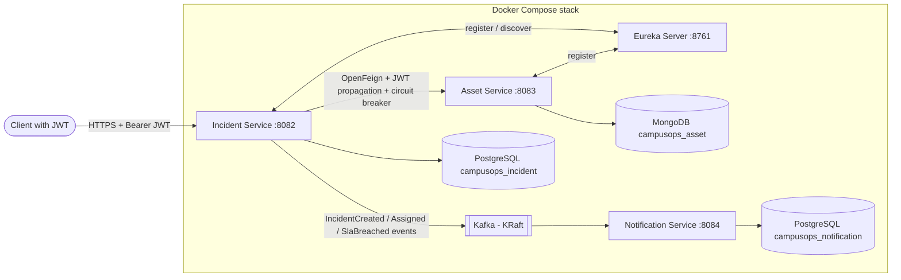
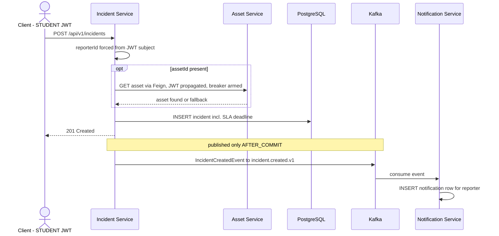
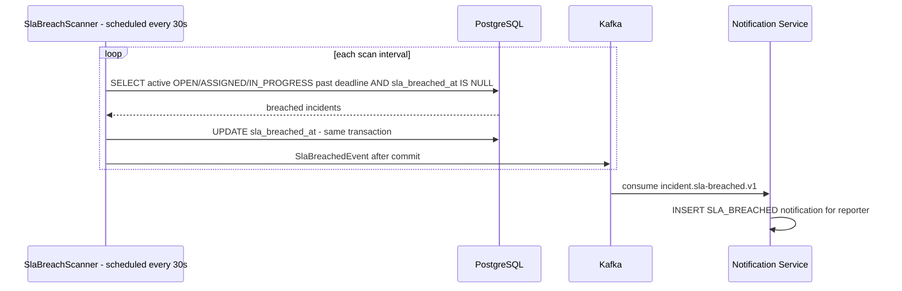
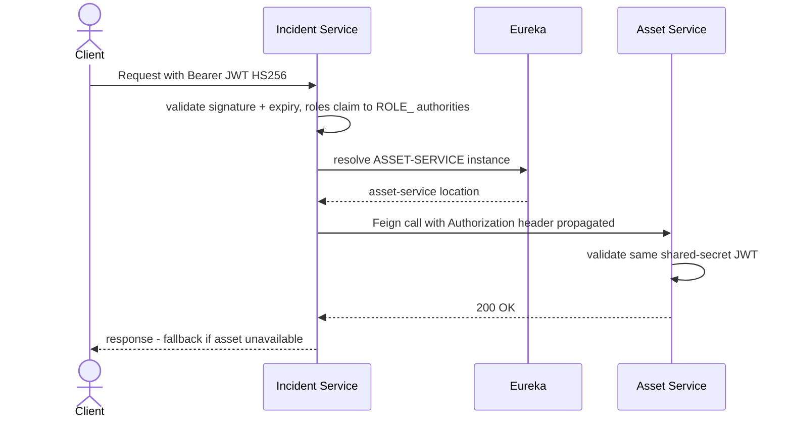

# CampusOps

CampusOps is a microservices-based campus incident management platform built for learning production-oriented architecture. Students and faculty report operational failures — broken projectors, AC outages, Wi-Fi drops, damaged lab equipment — and the platform manages each incident's full lifecycle: priority-based SLA deadlines, technician assignment, asynchronous notifications, and scheduled SLA-breach detection.

The project prioritizes understanding, correctness, practical architecture, maintainability, and interview value over complexity.

---

## Architecture summary

```text
Eureka Server (:8761)  —— service discovery
        │
        ├── Incident Service (:8082) ──── PostgreSQL (campusops_incident)
        │         │   │
        │         │   └── Kafka producer ──► incident.created.v1
        │         │                            incident.assigned.v1
        │         │                            incident.sla-breached.v1
        │         └── OpenFeign + Resilience4j ──► Asset Service
        │
        └── Asset Service (:8083) ──── MongoDB (campusops_asset)

Notification Service (:8084) ──── Kafka consumer ──── PostgreSQL (campusops_notification)
```

- **Synchronous communication:** Eureka service discovery + OpenFeign (Incident → Asset), protected by a Resilience4j circuit breaker with fallback.
- **Asynchronous communication:** Kafka (KRaft mode, no ZooKeeper). Incident Service publishes events after transaction commit; Notification Service consumes them.
- **Security:** JWT bearer authentication on Incident and Asset services (HS256 resource servers), role-based access control plus ownership checks.
- **Deployment:** full-stack Docker Compose — every service and database runs in containers.

---

## Architecture diagrams

### System architecture



### Incident creation flow



### SLA breach flow



### JWT validation and Feign propagation



---

## Service catalog

| Service | Port | Database | Discovery | Responsibility |
|---|---|---|---|---|
| Eureka Server | 8761 | — | — | Service registry |
| Incident Service | 8082 | PostgreSQL `campusops_incident` | Registered | Incident lifecycle/state machine, priority + SLA calculation, scheduled breach detection, event publishing, authorization rules |
| Asset Service | 8083 | MongoDB `campusops_asset` | Registered | Campus asset CRUD (projectors, routers, AC units, lab equipment) with flexible attributes |
| Notification Service | 8084 | PostgreSQL `campusops_notification` | **Not registered** (internal, event-driven) | Consumes Kafka events, stores notification rows, serves notification history |

### Key endpoints

**Incident Service — `/api/v1/incidents`**

| Method | Path | Access |
|---|---|---|
| POST | `/` | STUDENT (reporter forced from JWT subject) |
| GET | `/` | Role-scoped list (STUDENT: own, TECHNICIAN: assigned, MANAGER: all) |
| GET | `/{id}` | Ownership-checked |
| PUT | `/{id}` | STUDENT own incidents, MANAGER any |
| PATCH | `/{id}/status` | Ownership-checked, existing state machine enforced |
| PATCH | `/{id}/assign` | **MANAGER only** |

**Asset Service — `/api/v1/assets`**

| Method | Path | Access |
|---|---|---|
| POST | `/` | Any authenticated role |
| GET | `/?type=&status=` | Any authenticated role |
| GET | `/{id}` | Any authenticated role |
| PUT | `/{id}` | Any authenticated role |
| DELETE | `/{id}` | Any authenticated role |

**Notification Service — `/api/v1/notifications`**
- `GET /?incidentId=` returns notification history. Intentionally unauthenticated in v1 — it is an internal service API (see Known limitations).

**Actuator:** `GET /actuator/health` and `/actuator/info` are exposed on all three application services (permitted without JWT).

---

## Authorization matrix

Roles arrive in the JWT `roles` claim: `STUDENT`, `TECHNICIAN`, `MANAGER`.

| Action | STUDENT | TECHNICIAN | MANAGER |
|---|---|---|---|
| Create incident | ✅ (reporter = JWT subject, body value ignored) | ❌ | ❌ |
| View incident | own only | assigned only | all |
| Update details (PUT) | own only | ❌ | any |
| Progress status (PATCH) | own only, state machine applies | assigned only, state machine applies | any, state machine applies |
| Assign technician | ❌ (403) | ❌ (403) | ✅ |

Rules enforced in the service layer on top of coarse `@PreAuthorize` gating; a valid JWT alone never grants access. The incident state machine (`OPEN → ASSIGNED → IN_PROGRESS → RESOLVED → CLOSED`) applies unchanged to every role.

---

## Docker quickstart

Requires Docker Desktop.

```powershell
docker compose up -d --build   # build images and start the whole stack
docker compose ps              # wait until all 7 services show (healthy)
```

Expected healthy services: `campusops-postgres`, `campusops-mongo`, `campusops-kafka`, `campusops-eureka`, `campusops-incident`, `campusops-asset`, `campusops-notification`. Application health endpoints: `http://localhost:8082/actuator/health`, `:8083`, `:8084`.

Host port map (chosen to avoid clashing with native installations):

| Component | Host | Container |
|---|---|---|
| Eureka UI | 8761 | 8761 |
| Incident | 8082 | 8082 |
| Asset | 8083 | 8083 |
| Notification | 8084 | 8084 |
| Kafka | 9092 | 9094 (host listener) |
| PostgreSQL | **5433** | 5432 |
| MongoDB | **27018** | 27017 |

Inside the Compose network, applications use service names exclusively: `postgres:5432`, `mongo:27017`, `kafka:9092`, `eureka-server:8761`.

### Stopping the stack

```powershell
docker compose down       # stops and removes containers; named volumes (database data) are KEPT
```

```powershell
docker compose down -v    # ⚠ destructive: ALSO deletes the named volumes and all stored data
```

Use `down` for normal cleanup. Reserve `down -v` for intentionally wiping the containerized databases.

---

## Local development (without full Docker)

Each service is an independent Maven project with its own wrapper. Infrastructure can be started selectively:

```powershell
docker compose up -d kafka postgres mongo   # infrastructure only
```

Then run services individually (expects native config in each `application.properties`, or override with environment variables):

```powershell
cd incident-service;     .\mvnw.cmd spring-boot:run
cd asset-service;        .\mvnw.cmd spring-boot:run
cd notification-service; .\mvnw.cmd spring-boot:run
cd eureka-server;        .\mvnw.cmd spring-boot:run
```

Tests likewise run against local infrastructure (PostgreSQL, MongoDB); unit tests run anywhere.

---

## JWT / development token guide

> **There is no auth server, login endpoint, or password flow in v1.** Tokens are generated locally with a development utility and validated by the services as OAuth2 resource servers. This is deliberately not a login system.

`DevTokenGenerator` lives at
`incident-service/src/main/java/com/campusops/incident/security/dev/DevTokenGenerator.java`.

It mints HS256 tokens containing `sub` (subject = caller identity) and `roles` claims, valid for 8 hours, signed with the development secret (`campusops.security.jwt.secret`; override with `CAMPUSOPS_SECURITY_JWT_SECRET`).

Usage: run its `main()` with program arguments `<ROLE> [subject]`:

| Token | Program arguments |
|---|---|
| STUDENT | `STUDENT student-A` |
| TECHNICIAN | `TECHNICIAN tech-A` |
| MANAGER | `MANAGER manager-1` |

From IntelliJ: open the class → Run → edit configuration → add program arguments. From a terminal:

```powershell
cd incident-service
.\mvnw.cmd -q dependency:build-classpath "-Dmdep.outputFile=target\cp.txt"
java -cp "target\classes;$((Get-Content target\cp.txt -Raw).Trim())" `
  com.campusops.incident.security.dev.DevTokenGenerator MANAGER manager-1
```

Call secured APIs with `Authorization: Bearer <token>`.

---

## Kafka topics

| Topic | Producer | Consumer | Purpose |
|---|---|---|---|
| `incident.created.v1` | Incident Service | Notification Service | Register "your incident was received" notification for the reporter |
| `incident.assigned.v1` | Incident Service | Notification Service | Notify the assigned technician |
| `incident.sla-breached.v1` | Incident Service (scheduled scanner) | Notification Service | Notify the reporter that their incident breached its SLA |

Events are published only after the triggering database transaction commits (`@TransactionalEventListener(AFTER_COMMIT)`).

---

## Environment variables (Docker)

Spring relaxed binding maps these to the properties above. Two naming lessons worth noting — they differ from what intuition suggests:

| Variable | Purpose |
|---|---|
| `SPRING_DATASOURCE_URL` / `_USERNAME` / `_PASSWORD` | JDBC connection for Incident & Notification services |
| `SPRING_MONGODB_URI` | Asset Service Mongo connection (**not** `SPRING_DATA_MONGODB_URI`) |
| `SPRING_KAFKA_BOOTSTRAP_SERVERS` | `kafka:9092` inside the network |
| `EUREKA_CLIENT_SERVICEURL_DEFAULTZONE` | Registry URL (**not** `SPRING_EUREKA_…` — this property family has no `spring.` prefix) |
| `CAMPUSOPS_SECURITY_JWT_SECRET` | Shared HS256 secret for both resource servers |
| `CAMPUSOPS_SLA_DURATION_CRITICAL` (and low/medium/high, scan-interval) | SLA tuning; e.g. set `PT1M` to demo breaches quickly |

Defaults are documented development values inside `application.properties` / `docker-compose.yml`; nothing here is production-secret material.

---

## Testing

Verified passing state (JUnit 5, Mockito, Spring Boot Test):

```text
incident-service:     84 tests
asset-service:        28 tests
notification-service: 11 tests
                      ----
                total: 123
```

Coverage includes the SLA calculator, breach scanner deduplication, state machine, authorization matrix per role, full-stack security tests (401/403/201 flows over MockMvc with real filter chain), repository integration tests, and Kafka publisher/consumer routing tests. Tests use plain JUnit against local infrastructure — no Testcontainers.

Run per service: `.\mvnw.cmd test`

---

## Known limitations vs intentional v1 scope

Intentional scope decisions (by design, documented in ADRs): no API gateway, no Redis, no Prometheus/Grafana, no Kubernetes, no real email/SMS delivery.

Honest limitations of the current implementation:

- **No identity provider.** JWTs come from a development mint utility; there is no user store, login, refresh tokens, or key rotation. Production would introduce a real IdP and RS256 with managed keys.
- **Shared HS256 secret** across two services — acceptable for v1 demos, replaced by asymmetric keys + proper distribution in production.
- **Hibernate-managed schema** (`ddl-auto=update`) instead of migration tooling. Notably, growing a Java enum requires manually widening the generated DB CHECK constraint (this actually happened when `SLA_BREACHED` was added).
- **Single-node everything:** one Kafka broker (KRaft single node), one replica per Postgres/Mongo, single instance per service.
- **Docker Compose, not Kubernetes** — no scaling, self-healing beyond restart policies, or rolling updates.
- **No centralized secret management** — dev secrets live in configuration files/compose defaults.
- **No distributed tracing/observability** beyond Actuator health/info.
- **Notification API is unauthenticated** — intentional while it remains internal/event-driven, but it is a real boundary that production would close.
